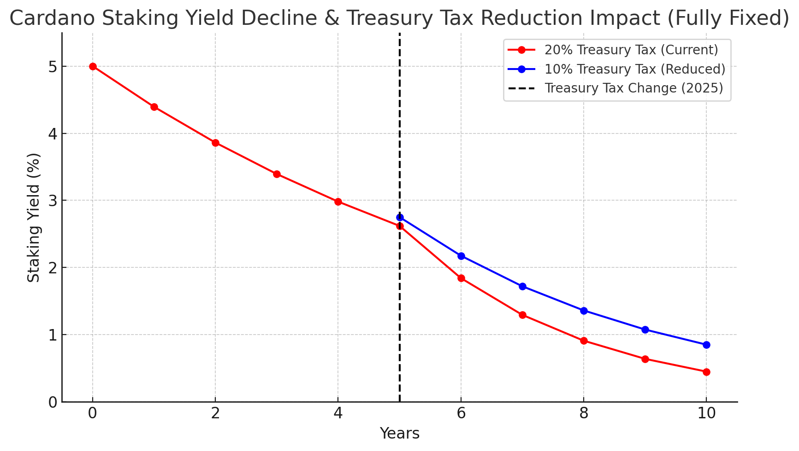

# **Predictive Modeling for Treasury Tax Reduction (20% to 10%)**

## **1. Introduction**
This document outlines a **predictive modeling approach** to assess the impact of reducing the Cardano Treasury tax from **20% to 10%**. The model evaluates multiple key areas: 
- Treasury sustainability
- Staking incentives & participation
- DeFi and stablecoin growth
- Network activity & transaction fees

Additionally, this document **addresses and counters concerns** raised by Chris O regarding the potential risks of implementing this change.

---

## **2. Methodology: How I Model the Impact of the Tax Cut**

### **2.1 Treasury Sustainability**
The Treasury receives a portion of transaction fees from Cardano network activity. I project treasury growth under both **20% and 10% tax rates**, using:
- **Starting Treasury Balance**: ₳1.67B (Source: Adastat)
- **Transaction Volume**: 196,681 transactions per epoch (Source: Messari, Cexplorer)
- **Average Transaction Fee**: 0.226 – 0.326 ADA (Source: Messari, historical fee data)
- **Estimated Treasury Inflow Per Year**:
  - **20% Tax Rate**: 648,970 – 936,225 ADA/year
  - **10% Tax Rate**: 324,485 – 468,112 ADA/year
- **5-Year Projection**: Modeled treasury balance over time.

**Formula:**

$$
\text{Treasury Balance}\_t = \text{Treasury Balance}\_{t-1} + \left(\sum\_{i=1}^{N} \text{Transaction Fees}\_i \times \text{Tax Rate} \right)
$$

**Expected Outcome:** Even with a 10% tax rate, **the Treasury continues to grow**, maintaining long term sustainability.

---

### **2.2 DeFi & Stablecoin Growth Impact**
A lower tax rate **reduces friction for DeFi participants** and encourages capital allocation to liquidity pools, benefiting Cardano’s stablecoin ecosystem. I model:
- **Current TVL**: $231.6M (Source: Messari, Q4 2024 Report)
- **Stablecoin Market Cap**: $20.7M (USDM growth: +148.5% QoQ) (Source: Messari)
- **Projected DeFi TVL Growth**:
  - Normal growth: +10% per year
  - Additional boost from tax cut: +5% (increased liquidity & LP incentives)
- **Projected Stablecoin Market Cap Growth**:
  - Normal growth: +7% per year
  - Additional boost from tax cut: +4% (higher DeFi activity attracts stablecoin demand)

**Formula:**

$$
\text{TVL}\_t = \text{TVL}\_{t-1} \times (1 + \text{Base Growth Rate} + \text{Tax Cut Boost})
$$

**Expected Outcome:** Lowering the tax accelerates **TVL and stablecoin adoption**, increasing **Cardano’s competitiveness in DeFi**.

---

### **2.3 Network Activity & Fee Revenue Effects**
The Treasury depends on transaction fees, and economic activity influences **how much revenue the network generates**. I model:
- **Transaction Growth Rate**: +3% per year (Source: Messari, historical network data)
- **Impact of Lower Taxes on Transaction Volume**: Lower friction encourages more on-chain activity.
- **Projected Transaction Fee Revenue Growth Over 5 Years**

**Formula:**

$$
\text{Transactions}\_t = \text{Transactions}\_{t-1} \times (1 + \text{Growth Rate})
$$

**Expected Outcome:** A lower tax **boosts transaction volume**, offsetting treasury reductions over time.

---

## **2.4 Staking Yield and the Treasury Tax Cut**

A key consideration in the debate surrounding the Treasury tax cut is its potential impact on staking yield. Some have argued that reducing the tax from 20% to 10% would significantly increase staking rewards; however, this assumption does not take into account the long-term trajectory of staking yield on Cardano.

### **A. Staking Yield is Declining Over Time**

Cardano's staking rewards initially started at around **5% annually in 2020** but have since declined to approximately **2.6% annually** as of recent data. This decline is expected to continue due to the network’s **monetary policy and reward structure**:

- **Depleting Reserve Fund**: At the launch of the Shelley era, a portion of rewards came from Cardano’s reserve fund. As this reserve diminishes over time, fewer ADA tokens will be available to supplement staking rewards.
- **Transition to Fee-Based Rewards**: Over time, staking rewards will shift from being supplemented by the reserve to being primarily funded by **transaction fees**. The rate of this transition depends on network adoption and transaction volume.

### **B. The Role of the Treasury Tax Cut in Yield Adjustments**

While reducing the Treasury tax from **20% to 10%** does return more ADA to the staking economy, this effect is **secondary** compared to the larger structural trends affecting staking rewards:

- **Short-Term Impact**: The immediate result of reducing the tax rate may lead to a temporary increase in staking returns due to higher ADA inflows.
- **Long-Term Perspective**: Since staking rewards are projected to decline **regardless of the tax rate**, any increase from the tax cut will be relative rather than absolute. The primary factor determining staking yield in the long run remains **network adoption and transaction fees**.

### **C. Governance and the Future of Staking Rewards**

The evolving economic model of Cardano suggests that **staking rewards should not be viewed in isolation from broader network growth**. Key factors that will determine future staking yield include:

- **Transaction Volume Growth**: As more applications and users transact on Cardano, the collected fees will contribute to staking rewards, potentially stabilizing yields.
- **Governance Adjustments**: The Cardano community may propose changes to staking parameters, potentially adjusting reward mechanisms in response to economic conditions.

### **D. Staking Yield Projection Model**

The declining staking yield can be modeled as follows:

$$
Y_t = Y_{t-1} 	imes (1 - d) + rac{F_t}{S_t}
$$

Where:
- $\( Y_t \)$ = Staking yield at time $\( t \)$
- $\( d \)$ = Decline rate due to reserve depletion
- $\( F_t \)$ = Transaction fees collected at time $\( t \)$
- $\( S_t \)$ = Total staked ADA at time $\( t \)$

This equation captures the two major influences on staking yield: **the natural decline from reserve depletion** and **the compensatory effect of transaction fees**.

### **5. Staking Yield Projection Chart**

Below is a visualization of staking yield decline over time, incorporating both the effect of the reserve depletion and the transition to transaction-fee-based rewards:

While the Treasury tax cut **may influence staking yield in the short term**, the long term decline in staking rewards is primarily due to the depletion of the reserve fund and the transition to a fee-based model. Network adoption, transaction fees, and governance decisions will play a far greater role in determining staking returns over time. Therefore, arguments that suggest a direct and permanent increase in staking yield due to the tax cut **overlook these larger structural factors**.

---

## **3. Countering Chris O’s Arguments**

Chris O argues that the Treasury tax should not be reduced due to potential risks. Below, I address each of his concerns with **data-backed counterarguments**.

### **Argument 1: "Reducing the Treasury tax increases staking yield, which is inflationary"**
**Chris O’s claim:** Lowering the tax increases staking rewards, which raises the risk free rate. In traditional finance, this is like lowering the funding rate, which is inflationary. This shift is a major change to ADA’s monetary policy.

**Counterpoint:**
- Staking does not create new ADA. It redistributes existing rewards. Unlike fiat systems where lowering interest rates increases the money supply, **Cardano’s staking system does not mint additional ADA beyond its predetermined monetary policy.**
- ADA’s monetary policy is already fixed. The staking yield increase is a function of **how rewards are distributed**, not an inflationary event that changes supply dynamics.
- Higher staking yield improves network security. More ADA staked means **higher participation, lower liquidity for market speculation and stronger resistance against 51% attacks.**
- Empirical Data: Looking at historical staking behavior, when **staking yields increase, network participation grows**, making the system more decentralized and secure.

**Primary Point:**  
Increasing staking yield does not create inflation. It strengthens network security and encourages participation, which benefits Cardano’s long term stability.

---

### **Argument 2: "The 20% Treasury allocation is critical to ADA’s monetary policy stability"**
**Chris O’s argument:** The 20% tax was designed to rapidly build the Treasury and is a key anchor of ADA’s monetary policy. Adjusting this could destabilize the system.

**Counterpoint:**
- The Treasury is already well funded. With **₳1.67B currently in the Treasury**, reducing the tax does not threaten sustainability.
- Treasury inflows will continue even at 10%. Transaction fees and staking rewards **still provide steady funding**. The projected treasury inflow at **10% remains in the hundreds of millions of ADA per year**.
- Treasury policy should be dynamic, not fixed forever. Cardano’s economy is evolving, and **Treasury management should adjust to reflect the network’s growth phase**.
- A treasury that grows too large without efficient allocation is inefficient. Treasury reserves that sit idle do not contribute to economic activity or network security.

**Primary Point:**  
The Treasury remains well funded at 10%, and policy must adapt to network needs rather than remain arbitrarily fixed.

---

### **Argument 3: "Cardano’s market cap stability depends on the 20% tax"**
**Chris O’s claim:** Cardano’s capital structure has kept it in the top 10 for 8 years. Changing one variable could have unforeseen second and third order effects that harm stability.

**Counterpoint:**
- Market cap stability is driven by adoption, not Treasury tax rates. The **largest factors** influencing Cardano’s market cap ranking are **network adoption, DeFi growth, stablecoin usage and institutional participation. Not the Treasury tax rate.**
- Ethereum, Solana, and other major networks do not have a rigid 20% Treasury tax. Yet they continue to grow through strong **DeFi participation and staking models that adapt to economic conditions.**
- Stagnation is more harmful than change. Refusing to optimize economic incentives in fear of theoretical second order effects **prevents growth and makes Cardano less competitive.**

**Key Takeaway:**  
Maintaining a top market cap ranking requires adoption and ecosystem growth not an arbitrary tax rate. Lowering the tax rate helps stimulate **network engagement, DeFi and staking participation.**

---

### **Argument 4: "We don’t fully understand the risks. Changing Treasury policy now is premature"**
**Chris O’s claim:** Cardano’s economic system has complex dependencies, and changing one variable, like the Treasury tax, could create unintended risks we don’t yet understand. We need predictive models before making changes.

**Counterpoint:**
- We have predictive models. These 5-year simulations **show Treasury growth remains stable** under a 10% tax, while **staking participation, DeFi TVL and network activity increase.**
- Treasury inflows are predictable based on historical transaction volumes. There is no uncertainty in how much ADA flows into the Treasury **before and after a tax reduction.**
- If unforeseen issues arise, governance can adjust. Governance **already has mechanisms** to modify parameters if the tax reduction causes unintended consequences.
- Keeping the tax at 20% does not mitigate risk. It only delays economic growth. Cardano’s ability to **adapt to real world conditions** is more important than avoiding change due to theoretical concerns.

**Primary Point:**  
Predictive modeling already shows the Treasury remains stable at 10% and governance can adjust if needed. The risk of not evolving is greater than the risk of careful and data driven change.

---

## **The Stablecoin Economy and Sovereign Wealth Fund: Separate Issues from the Treasury Tax Cut**

The discussion around **supporting stablecoins and creating a sovereign wealth fund** is entirely separate from the **current governance action to reduce the Treasury tax from 20% to 10%**. While both discussions relate to Cardano’s long term economic strategy, one does not depend on the other. Below, I outline how each issue should be considered independently and the paths forward, regardless of how the current governance vote turns out.

## **1. The Current Treasury Tax Cut Proposal**
- Right now, 100% of the 20% tax goes to the Treasury, with no automatic allocation to stablecoins, liquidity mechanisms or a sovereign wealth fund.
- The proposal reduces this tax to 10%, allowing the remaining 10% to naturally flow back into staking rewards.
- This proposal does not preclude the creation of a sovereign wealth fund or stablecoin incentives in the future. If passed, a separate governance action would still be required to allocate any portion of funds toward those initiatives.

### **If This Action Fails**
- The Treasury tax remains at 20%, meaning all funds continue flowing into the Treasury with no automatic support for stablecoins or a sovereign wealth fund.
- A separate governance action would still be required to allocate part of the Treasury toward these goals.
- This means rejecting the tax cut does not inherently support stablecoins. It only maintains the status quo.

### **If This Action Passes**
- The Treasury tax is reduced to 10%, and the remaining 10% is distributed back into the staking economy.
- The community can still propose a new governance action to allocate a portion of the Treasury’s growing reserves toward a sovereign wealth fund or stablecoin liquidity support.
- This approach allows for a deliberate, structured decision about how best to implement such a fund, rather than tying it directly to the tax rate reduction.

## **2. Two Paths to Supporting a Sovereign Wealth Fund or Stablecoin Economy**
If the community decides to establish a sovereign wealth fund or direct incentives toward stablecoin growth, there are two viable paths forward:

### **Option 1: Hard Fork to Create an Automated Fund Flow**
- Would require a protocol level change to automatically allocate a portion of Treasury inflows to a sovereign wealth fund.
- Ensures a predictable and committed allocation without requiring constant governance votes.
- Provides long term stability and strong institutional signaling, making Cardano’s stablecoin ecosystem more attractive to major players.
- **Downside:** Requires more time and coordination to execute due to the hard fork requirement.
- **A constitutional amendment would be required to formally establish this automated allocation, ensuring transparent fund management and preventing misuse.**

### **Option 2: Governance-Based Withdrawals from the Treasury**
- Treasury remains at either 20% or 10%, with governance directing allocations on a case-by-case basis.
- Allows for immediate allocation decisions without needing a protocol change.
- Provides greater flexibility but introduces governance overhead and potential inefficiencies.
- **Downside:** Could result in inconsistent or politically influenced funding decisions over time.
- **A constitutional amendment would be necessary to set clear rules and guardrails around fund withdrawals, preventing arbitrary or mismanaged allocations.**

## **3. The Benefits of a Sovereign Wealth Fund Beyond Stablecoins**
A **sovereign wealth fund** is a powerful tool that could be leveraged for **multiple areas of Cardano’s long term economic growth** beyond just stablecoins. If implemented correctly, it could provide:
- **Liquidity Support for Stablecoins:** A controlled pool of funds to provide liquidity backing and incentives for stablecoin adoption.
- **Funding for DeFi Growth:** Grants or investments into DeFi projects that bring utility and transaction volume to Cardano.
- **Ecosystem Incentives:** Support for dApps, on-chain governance initiatives, and infrastructure development.
- **Protocol R&D:** Funding to advance Cardano’s technology stack and maintain a competitive edge in blockchain innovation.
- **Market Stability Reserves:** Used to counteract extreme volatility in ADA’s price by deploying strategic liquidity when needed.
- **A second treasury for long term sustainability:** The sovereign wealth fund could act as an additional treasury, ensuring Cardano has financial reserves independent from short term governance shifts.

## **4. Modeling Sovereign Wealth Fund Growth**
The potential for **a sovereign wealth fund to grow over time** depends on **initial allocation, periodic funding mechanisms and investment strategies**. A simple model for growth could include:

### **Scenario 1: Allocating 50% of Treasury Growth to a Sovereign Wealth Fund**
Analyzing the Treasury balance change from **Epoch 470 to Epoch 471**, the growth per epoch was **4,962,569 ADA**.

$$
G_{epoch} = T_{epoch+1} - T_{epoch}
$$

Assuming **73 epochs per year**, this equates to **~362M ADA annually**.

$$
G_{annual} = G_{epoch} \times 73
$$

If **50% of this growth** is directed into a Sovereign Wealth Fund, **181M ADA per year would be allocated**.

$$
SWF_{allocation} = \frac{G_{annual}}{2}
$$

As ADA enters the SWF, it would be **sold for USD at today's price of $0.72 per ADA**, resulting in an estimated **$130M USD annually** entering the fund.

$$
SWF_{t+1} = SWF_t + (SWF_t \times r) + SWF_{USD}
$$

This USD allocation would be invested in diversified assets earning an **assumed 6% annual yield**.

### **Scenario 2: A One-Time 800M ADA Sale at $0.72 USD into the Sovereign Wealth Fund**
If 800M ADA is sold at today’s price of **$0.72 per ADA**, the fund would start with **$576M USD**.

$$
SWF_{USD}^{one-time} = 800,000,000 \times P_{ADA}
$$

This fund would be invested in **diversified financial instruments (bonds, DeFi, etc.)** at an **assumed 6% annual yield**.

$$
SWF_{t+1}^{one-time} = SWF_t^{one-time} + (SWF_t^{one-time} \times r)
$$

## **5. Comparing the Two Approaches**

Both methods of funding a Sovereign Wealth Fund offer distinct advantages. Below is a breakdown of how each approach impacts fund growth.

| **Funding Method**        | **Initial Capital**  | **Annual Growth Rate** | **10-Year Projection** |
|---------------------------|----------------------|------------------------|------------------------|
| **50% of Treasury Growth** | Gradual inflows (~$130M/year) | 6% USD yield | Grows progressively with Treasury contributions |
| **One-Time 800M ADA Sale** | $576M USD upfront | 6% USD yield | Immediate large fund with stable returns |

Mathematically, both methods follow **different growth trajectories**, modeled as:

- **For Treasury Growth Allocation**:

$$
SWF_{t+1} = SWF_t + (SWF_t \cdot r) + SWF_{USD}
$$

- **For the One-Time 800M ADA Sale**:

$$
SWF_{t+1}^{\mathrm{OT}} = SWF_t^{\mathrm{OT}} + (SWF_t^{\mathrm{OT}} \cdot r)
$$

This table illustrates how the **50% Treasury growth method** ensures **sustainable funding over time**, while the **one-time 800M ADA sale** provides **immediate liquidity** for large scale initiatives.

---

## **6. Why This Governance Action Should Focus Only on the Tax Cut**

- The creation of a sovereign wealth fund and stablecoin incentives requires separate governance discussions with clear allocation mechanisms and oversight.
- If this governance vote is rejected, the community still has to decide how to allocate Treasury funds. Simply keeping the tax at 20% does not create a sovereign wealth fund or stablecoin incentive program automatically.
- If this governance vote is passed, the community can still decide how best to use Treasury funds, but with a more optimized staking economy.
- The best approach is to approve the tax reduction now, then propose a separate governance action to establish a sovereign wealth fund with proper safeguards and mechanisms.

---

## **7. Conclusion**

- The Treasury tax cut and sovereign wealth fund discussions are separate and should be treated as independent governance decisions.
- A separate governance action would be required to establish a sovereign wealth fund or stablecoin incentive program, regardless of whether the tax cut passes or fails.
- **A constitutional amendment would be necessary in either case** to ensure transparency, prevent misuse, and establish clear management guardrails.
- The most efficient path forward is to reduce the tax rate first, then hold a structured discussion on the best way to implement sovereign wealth mechanisms with proper safeguards and oversight.

